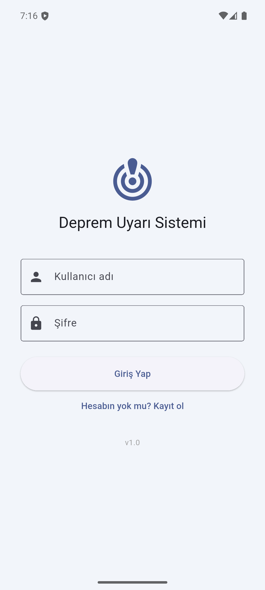
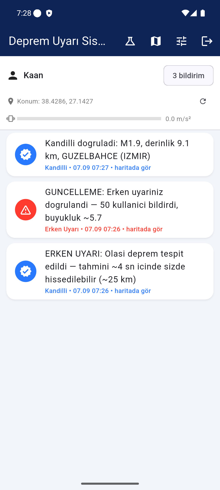
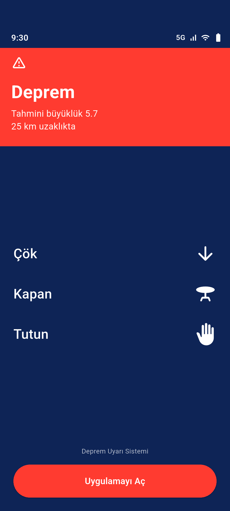
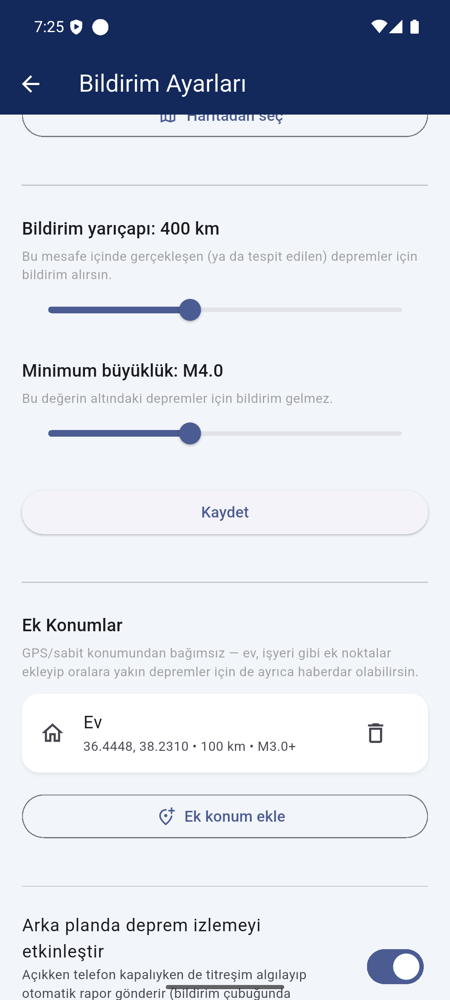
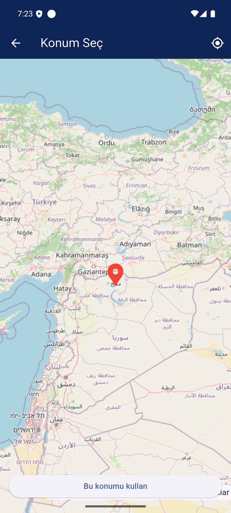

# Deprem Uyarı Sistemi (Earthquake Warning System)

A crowd-sourced earthquake early-warning system for Turkey, built as a summer
internship project. It combines phone accelerometer data, a two-layer
on-device detection model, and official Kandilli Observatory data to warn
users before — or as soon as possible after — an earthquake hits, inspired by
systems like Google's Android Earthquake Alerts and UC Berkeley's MyShake.

## How it works

1. **Detection.** With background monitoring enabled, each phone runs a
   continuous STA/LTA trigger on its accelerometer, tuned to catch a P-wave
   level signal (lighter than the main shaking) rather than a fixed
   acceleration threshold. A second on-device classifier — a Random Forest
   trained on STEAD, CSN, AFAD, and UCI-HAR data — filters out false
   positives (dropped phones, walking, etc.) before anything is reported.
2. **Crowd confirmation.** The backend clusters reports arriving from nearby
   phones within a short time window. Once enough independent reports agree,
   it fires a crowd-sourced alert — including a fast "preliminary" path that
   estimates arrival time for users who haven't felt it yet, based on P-wave
   travel speed.
3. **Official confirmation.** When the official Kandilli Observatory feed
   later confirms the same event, matching users get a second, authoritative
   notification with the verified magnitude, depth, and location.
4. **Critical alert delivery.** A genuine earthquake alert opens a full-screen
   warning automatically — even from a locked screen — using Android's
   full-screen-intent notifications, the same mechanism used by incoming
   calls and alarms. If the screen is already on, the OS intentionally
   restricts this to a high-priority heads-up banner instead (a platform
   policy no app can override), so the alert still surfaces without
   hijacking whatever the user is doing.
5. **Extra locations.** Beyond your own GPS (or a manually pinned) location,
   you can save additional points to watch — a parent's house, a workplace —
   each with its own radius and magnitude threshold, independent of your own.

## Screenshots

| Login | Notifications | Critical full-screen alert |
|:---:|:---:|:---:|
|  |  |  |

| Settings — location & thresholds | Map-based location picker |
|:---:|:---:|
|  |  |

## Tech stack

| Layer      | Stack |
|------------|-------|
| Mobile app | Flutter (Dart), Firebase Cloud Messaging, flutter_local_notifications, flutter_map (OpenStreetMap), Geolocator |
| Backend    | FastAPI, SQLModel (SQLite), JWT auth, Firebase Admin SDK for push |
| ML         | On-device Random Forest classifier (trained offline on STEAD/CSN/AFAD/UCI-HAR) |

## Project structure

```
.
├── app/       # Flutter mobile application
└── backend/   # FastAPI backend
```

## Getting started

### Backend

```bash
cd backend
pip install -r requirements.txt
cp .env.example .env   # then fill in a real SECRET_KEY
```

You'll also need a Firebase service account key (`firebase-service-account.json`,
from your Firebase project's Settings → Service Accounts) placed in `backend/`
for push notifications to work — it's intentionally not included in this repo.

```bash
uvicorn src.main:app --reload
```

API docs are then available at `http://127.0.0.1:8000/docs`.

### Mobile app

```bash
cd app
flutter pub get
```

Requires your own Firebase project connected via `flutterfire configure`
(this generates `firebase_options.dart` and `android/app/google-services.json`,
neither of which are included here). Update `ApiClient.baseUrl` in
`lib/core/api_client.dart` to point at your backend.

```bash
flutter run
```

## Known limitations

This is a working prototype, not a production-grade emergency system:

- Single SQLite file and a single backend process — not built to scale past
  a demo/pilot audience.
- Detection thresholds and the P-wave classifier were tuned on limited data
  and have never been validated against a real earthquake.
- The full-screen critical alert is Android-only; iOS only receives a
  standard notification for now.
- No automated test suite — all verification so far has been manual and
  scenario-driven.

## License

MIT — see [LICENSE](LICENSE).
